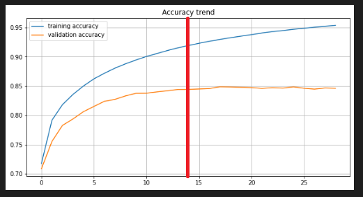

# Project report

Here it has described all the work related to the project.

The report is structured in the following sections:

- [Project report](#project-report)
  - [The problem](#the-problem)
  - [The dataset](#the-dataset)
  - [The techniques experimented](#the-techniques-experimented)
    - [Data Preprocessing](#data-preprocessing)
    - [Build and train the model](#build-and-train-the-model)
    - [Test the model](#test-the-model)
  - [Results of experiments](#results-of-experiments)
    - [Training phase results](#training-phase-results)
    - [Inference phase results](#inference-phase-results)

---

## The problem

The growth of research in the NLP field is allowing to use some application which nowadays makes part of our life. In particular, the explosion of the Deep Learning has permitted to create tools capable to solve difficult tasks, for example the Machine Translation which will be deal with here.

Machine Translation is a particular task used to translate sentences from one language to another. It is not simple as can seem, because it is inefficient to translate word per word (the so-called literal translation). Indeed, the meaning of the words in a language do not have equivalencies with the meaning of the words to another language. To understand the differences, there is the necessary to the machine to make experience with sound sentences: in other words, to train it.

Now, the question is how to build the machine translator. And here Deep Neural Networks, which are complex mathematical models, come to help us. "Deep" stands for a neural Network with an input and an output layer, plus at least one hidden layer. At every level, the units have the same activation function, and in the context of Deep Learning these are non-linear, in order to understand the main features of the data given in input and what are the possible correlations. Generally, the more data is trained, the more the network performs: it is true until the network generalizes well, so do not overfit.

So, the problem posed for this project is to reproduce the behaviour of a Neural Machine Translation (NMT), focusing on the Seq2Seq model. More in detail, NMT can be implemented as an encoder-decoder model, where the encoder takes a source sentence in a language, whereas the decoder try to translate it in another language. To implement this architecture, Recurrent Neural Networks (RNN) with Long Short Term Memory (LSTM) are used, because the vectoral representation of a sentence changes at every timestep (where typically a word is translated), permitting to unfold the network and passing the new updates states through time among the units. Furthermore, the model predicts a word given in input selecting the most likely translated word among all the output vocabulary words according to the past words translated; so, the translation follows a probabilistic behaviour.
The encoder RNN outputs its own internal state, the so-called *context*, that is the final state vector which will be the initial state for the decoder; thanks to the *context* state, the decoder RNN obtains information about what translated sentence is supposed to generate. During the training phase, the *teacher forcing* method is involved in the decoder RNN: indeed, it is trained to transform the target sequences into the same sequence, but offset by one timestep in the future. In our case, the decoder RNN already knows that the first word is the special tag \<sos\>, which indicates the start of sequence. It is necessary  because the selection of the next word is always dependent on the past selected words. Furthermore, it is useful another special tag \<eos\>, which indicates the end of sequence and so the end of the translation.
The training model is different to the testing model (called also *inference model*): indeed, the process needs to be modified in a way that the encoder RNN is used only to generate the *context* state vectors from the input sequence, whereas the words are predicted one-by-one and they must be reinjected into the decoder RNN until reaching the \<eos\> tag.

In this project, the only working Seq2Seq model is implemented at a character-level, so the prediction of a sentence is made character-by-character. So, every consideration about the result we have obtained will be based on it. In a real-world scenario, the most popular Seq2Seq model is implemented at a word-level. The advantage is that no words can be invented as with a character-level model (it is obvious because the dictionaries are based on words and not on characters), but the disadvantage comes from the consistent computational resources which it requires in order to obtain good results.
Anyway, in the repository are implemented both the version. Finally, the repository contains a word-level Attention model, a better and more complex implementation of a NMT in which the training and inference models are based always in RNN layers with LSTM units, adding the Attention mechanism that permits to memorize long sequences. In fact, Seq2Seq models has the problem that they do not remember the long dependencies between parts of the same sentence that are far away. Anyway, in this report we will not talk in detail about the Attention model, but we will focus on the two types of Seq2Seq models (with a main focus on the character-level one).

The final consideration of this project is made in the character-level Seq2Seq model translation goodness. To verify it, the BLEU metric is used, that is considered by the NMT community the most used metric even though it presents some gaps that we will discover at the final part of this report.

<div align="right"\>

[Back to top](#project-report)
</div>

## The dataset

Data plays a fundamental role in all Machine Learning techniques. They permit to define the task: for example, if there is the necessity to build a Machine Translator for lawyers, I need that the dataset domain belongs to a legal language, in order to guarantee a specific grammar and semantic. Last, but not least, Machine Translation needs a big amount of data: indeed, the more data available, the larger the vocabulary and the more idioms the NMT can learn.

The common practice used for the Machine Translation Task is to use parallel corpora, which are huge corpus containing sentences in a start language and the corresponding translated sentences in a target language. There are datasets available on the Web which can be used for open source projects and are exploited to train the NMT; in particular, the [OPUS project](https://opus.nlpl.eu/index.php) contains all the open parallel corpora, like the most famous [Europarl](http://www.statmt.org/europarl/). Sometimes, there are the corresponding dataset used for the testing phase of a NMT.

Unfortunately, these dataset cannot be use in this context due to the low computational resources. Indeed, if there are a lot of data, the input vocabulary and the target one becomes very large; the consequence is that when the Seq2Seq model is executed, the generated tensors are too big and it is impossible to load them in the remaining memory. This problem has been recurrent in some steps of the project, so our NMT has been trained (and also tested) to a smaller parallel corpora.

The target of this project is to translate English sentences to Italian ones. So, it has been chosen the [Tatoeba](http://www.manythings.org/anki/ita-eng.zip) English-Italian parallel corpora. The latter is an open source project, where all the datasets contain the original sentence in English language and the corresponding verified annotation in a certain language (in our case, Italian).
The dataset contains 352040 parallel sentences and every row is composed as follows:

```@
English sentence + \t + Italian sentence + \t Attribution
```

For example, the first row is:

```@
Hi. Ciao! CC-BY 2.0 (France) Attribution: tatoeba.org #538123 (CM) & #607364 (Cero)
```

What interests us are *English sentence* and *Italian sentence* of every row, where they will be saved into the corresponding *input_sentences* and *output_sentences* lists in the project code. All the rest is discarded.

For our purposes and for computational reasons, the number of sentences chosen for the training phase is 20000 (saved in the *NUMBER_SENTENCES* global variable), whereas the number of sentences chosen for the testing (inference) phase is 2000 (saved in the *NUMBER_SENTENCES_TEST* global variable).

<div align="right"\>

[Back to top](#project-report)
</div>

## The techniques experimented

> Premise: all the techniques listed below refer to the character-level Seq2Seq model. Every experiment about the word-level SeqSeq model will be written in an apposite sub-paragraph which starts with the wording: *Considerations about the word-level NMT*.

### Data Preprocessing

The first step applied is the so-called **Data Preprocessing**. This is fundamental and it is mandatory before building the Neural Network models. More in detail, the dataset is composed by string sentences, but to permit that Neural Networks could understand the input we need to convert them into sequences of floats. The pre-processing requires some techniques. First, we save the sentences of the training data into the apposite lists, where the input sentences are saved as they are, whereas the target sentences are saved with special tags to identify the start ("\t") and the end ("\n") of the sequence. They are necessary for the decoder RNN of the model, in order to understand when to start and to end the translation. Starting from these lists, it is required the creation of two vocabularies, one for the start language (the English) and one for the target language (the Italian). Every vocabulary contains all the unique characters encountered in the sentences, included punctuation and special symbols. Moreover, for every vocabulary it is introduced the "UNK" character, that is responsible to replace a character during the prediction phase if it is not indexable (so, the character predicted is not available in the vocabulary, because remember that the vocabulary is based on the training data sentences and not on the test ones). An important thing to remark is the dictionary is structured by (key, value) tuples, where the key is a character, whereas the value is an integer number that corresponds to the character. Moreover, it is created the reverse vocabularies, where they are structures in (value, key) tuples, and they are useful to convert the prediction made from a sequence of floats to a string sentence.  

So, after this step, it is applied the *Tokenization* technique, so the string sentences are transformed into sequences of floats in the apposite tensors (in the code, *encoder_input_data*, *decoder_input_data*, *decoder_target_data*). More in detail, these tensors contains for every sentence the representation of the characters in an one-hot encoding. It permits to represent uniquely the character, but it implies that the data structures result more sparse (there are a lot of zeros and few 1.0) and the space complexity increases proportionally to the increasing of the dictionaries. This choice has been made because we use a dataset with short sentences, and so we are sure to not overcome the available memory. Otherwise, this choice with long sentences would be really inefficient. Speaking about the three tensors mentioned, *encoder_input_data* contains the English sequences of floats; whereas *decoder_input_data* and *decoder_target_data* contains both the Italian sequences of floats, but with a little difference: *decoder_input_data* is used as input for the decoder RNN (for the *teacher forcing* method) whereas the *decoder_target_data* is used as "gold labels" to compare it with the prediction obtained by the decoder RNN. Moreover, *decoder_target_data* is offset by one timestep because it does not include the start of sequence character ("\n"). The same job is made with the *test_sentences_data* tensor, which saves the English sequences of floats for the testing phase. There is another technique which is not visible directly but deserves to be mentioned: the *Padding* technique. With Seq2Seq models, the length of the sentences (both for input and target ones) are fixed in this way: for the input, according to the maximum length of the training data English sentence; for the output, according to the maximum length of the training data Italian sentence. Now, these represent the second dimension used in the tensors cited above, so it means that if there is a sequence shorter than the maximum sentence, at a certain point there will be only zeros until the end of the sequence. In other words, if the sequence is shorter than the maximum sentence, it needs to be padded, so fill-up the sequence of zero from the last value different from zero values until the maximum length of the sequence. Now, this technique seems to not applied directly at code level, because it is already executed in the very creation of the tensors, which are filled-up with zeros.

> *Considerations about the word-level NMT*
>
> - After saving the sentences of the training data into the apposite lists, there is an important step called *corpus cleaning*, where all the punctuation and special symbols are removed from the sentences and all the words are lowercased. The cleaning is necessary to save computational time. Nevertheless, the punctuation plays an important role to give a meaning to certain part of the sentences, so it could be possible to not remove it and saving it inside the dictionary, in order to predict not only words but even punctuation.
>
> - The string sentences are converted in sequences of integers. So, *encoder_input_data* and *decoder_input_data* have a reduced dimensionality, and they become matrices (only two dimensions). The *decoder_target_data* data structure instead remains a tensor with a one-hot encoding, for the reason that at the last level of the Neural Network model the activation function is the "softmax", which is well known to compare only values between 0 and 1.
>
> - After *Padding*, there would be another important and final step to apply, which is the *Word Embeddings* one: it permits to represent a word in a vector representation. Now, we know that a sentence is given in input as a sequence of integers, where every integer corresponds to a specific word (except for zero integers that simply represent the padding). The question is: why we need a word representation for every word if we have already translated the string sentence in the corresponding sequence of integers? The answer is because a simple integer is related to a word and it does not give other useful information about a word, in a way that we are not able to understand if that word is more similar to other words. Instead, if we represent that word (which corresponds to a specific integer with respect to the vocabulary) as an n-dimensional dense vector, we can assume that if words have similar vectors, they are similar. There are two types of Word Embeddings techniques. The first is the simplest, so downloading a file which contains pre-trained word embeddings and, for all input vocabulary words, saving the corresponding word embeddings in an "embedding matrix"; with this technique, it is possible to do not match these information because a vocabulary word can be absent from the pre-trained word embeddings file: in that case, the word embedding for that word remains empty. One of the most famous pre-trained word embeddings can be found in [GloVe](https://nlp.stanford.edu/projects/glove/), with files of different vector dimensions; it is important to download the right file according to the embedding size applied to the Neural Network. The second technique is more complex because it requires to the developer to upload a library in order to create a personal pre-trained word embeddings file. It is possible with [Gensim](https://pypi.org/project/gensim/) library, where given in input list of lists of strings (in order to analyze word per word, and not sentence per sentence), the word embeddings can be trained with a specific algorithm (skip-gram or CBOW). Finally, in an "embedding matrix" every word will have the corresponding word embedding. Finally, if we apply the *Word Embeddings* technique, the Neural Network model will have necessarily a not trainable Embedding layer (otherwise it has to be trainable).

### Build and train the model

After pre-processed the available data, the second step is to *build the model*, and now it comes into play the character-level Seq2Seq model. The architecture used in this context is the Encoder-Decoder one: the encoder component takes the input sequence and produces the internal state vectors (called also *context vectors*) which serve as conditioning for the decoder, whereas the decoder component is responsible for predicting the individual characters of the target sequence. Both the encoder and the decoder are LSTM model, where LSTM stands for "Long-Short Term Memory" and is an advanced RNN (Recurrent Neural Network) that allows information to persist during time and is capable to overcome the vanishing gradient problem for how its architecture is built.

The encoder component is structured as follows:

- An *Input* layer, where the *encoder_input_data* input sequences are given;
- A *LSTM* layer, where the characters are elaborated. It is important to set *return_state* as *True*, because the *context vectors* are necessary later.

As told before, at the end of the reading of the entire input sequence, the encoder encapsulates the information for all input elements in the *context vectors*, that will be the initial state for the LSTM layer of the decoder. The encoder outputs instead are discarder.

The decoder component is structured as follows:

- An *Input* layer, where the *decoder_input_data* target sequences are given. This layer is necessary to guarantee the *teacher forcing* method;
- A *LSTM* layer, where the characters are elaborated. The initial states are initialized to the encoder *context vectors*. Besides *return_state*, it is important to set *return_sequences* as *True* in order to return the output sequences (the current translation);
- A *Dense* layer, to return the individual characters from the decoder's output. Here we use the softmax activation function, which permits to obtain the probability for each character to be the next character for the translation. All the probabilities sum to 1 (all values are normalized), and the more likely character is chosen.


After building the model, the next step is to *train the model*. We know that the final Dense layer of our model returns values which are in a range between 0 and 1, because they are probabilistic values. So, the better loss function is the *categorical cross-entropy*, because the *decoder_target_data* target sequences are represented in an one-hot encoding (as requested by the [documentation](https://keras.io/api/losses/probabilistic_losses/#categoricalcrossentropy-class)). This loss function is a standard choice for classification problems and is calculated on the predicted sequences from each time step; furthermore, the errors are backpropagated through time in order to update the Neural Network parameters.

> *Considerations about the word-level NMT*
>
> - The first consideration is obvious: with a word-level NMT, a *Dense* layer returns the individual words from the decoder's output at every timestep.
>
> - We talked about how *Word Embeddings* play an important role in the context of a word-level model. For this reason, the corresponding NMT model must be modified: both for the encoder component and the decoder one, it must be added the *Embedding* layer between the *Input* and the *LSTM* layers. The number of units depends on the dimension of the vectors in which a word is represented. If an *embedding matrix* is implemented, the *Embedding layer* needs to set the weights to the *embedding matrix* and it must not be trainable (the vector representations are already pre-trained); otherwise, this layer can be trainable.
>
> - Below it is provided a representation of a word-level Seq2Seq model (pay attention: this image does not correspond to our model, because there is an extra LSTM layer)
>
> 

### Test the model

The third and last step applied in this project is to *test the model*. What we want to do is verify the goodness of translations, given the input sequences which derives from a specific test set (represented in the code as *test_sentences_data*). To do that, we do not need to train again the model: indeed, we saved the all final weights of the training model and we can reuse them as starting point for our inference model. The latter is quite similar to the training model, except for little modifications in the architecture of the decoder component and the procedure to apply the inference. Furthermore, the *teacher forcing* method must not be used anymore, because the aim at this step is to decode independently a target sequence starting from an unseen input without any help, in order to understand if the model has been trained in a positive way or not and if it works properly in a real scenario.

First of all, the encoder component architecture remains unaltered, and the pre-trained weights are restored. On the other hand, the decoder component architecture undergoes a modification at the Input layer. Indeed, the inference model has three Input layer: one for taking in input one character at a time, and the other ones are reserved to save the *context vectors* in order to reuse them for the next timestep. Finally, the two components must be split, because the encoder component is used only the first time to generate the *context vector* whereas the decoder component is used as many times as there are characters to predict.

So, the inference procedure provides the generation of one character at time, and it is done as follows:

- the input sequence is encoded and returns its *context vectors*;
- the initial states of the decoder are set to the *context vectors*;
- the initial input to the decoder is the start of sequence tag ("\t");
- the decoder runs, taking in input the initial input and the initial states;
- at each timestep, the states of the decoder are preserved and they are set as initial states for the next timestep;
- at each timestep, the predicted output becomes the input in the next timestep;
- the loop continues until the decoder predicts the end of sequence tag ("\n").

This procedure is done by the *decode_sequence* function.

> *Considerations about the word-level NMT*
>
> - The first consideration is obvious: with an inference word-level NMT, a word is predicted at each timestep. Furthermore, the start and the end of sequence tags are respectively "\<sos\>" and "\<eos\>".
>
> - By an architectural point of view, the model is equal to the inference character-level model, except for the adding of the *Embedding* layer: in the encoder component, between the Input layer and the LSTM one, and in the decoder layer between the Input layer (which takes one word at a time) and the LSTM one.
>
> - Below it is provided a representation of how an inference word-level Seq2Seq model works at a high-level:
>
> 

<div align="right"\>

[Back to top](#project-report)
</div>

## Results of experiments

We saw how to build a character-level Seq2Seq model, with an eye on the word-level one. Nevertheless, the only result we can analyse better comes from the character-level model, because for the word-level model would need more data to train the model but due to low computational resources the results are unsatisfactory. So, we cannot make a comparison between the results about the two models.
Anyway, we can analyse two types of results deriving from the character-level Seq2Seq model: the accuracy and the loss values during the training phase, and the BLEU metric values during the inference phase.

### Training phase results

We start from the training phase, where the target is to train the model given in input the input sequences (*encoder_input_data* for the encoder and *decoder_input_data* for the decoder), comparing the final results at every epoch with the target sequences (*decoder_target_data*). These data comes exclusively from the training set and, at every epoch, the 10% of these data are randomly selected to apply cross-validation and they are inserted into the validation set, in order to compute the validation loss. The latter is called also "the empirical error", and it corresponds to the percentage of incorrectly classified labels given the validation set. Don't confuse validation set with test set: indeed, the validation set is fundamental during the training phase, because it is used to evaluate the estimation of the empirical error at every epoch, where the target in this case is to choose the better evaluation, that corresponds to have the better hyperparameters for our model; whereas test set is always involved when the model is already pre-trained, in order to evaluate the true error of it, where the target is to give in input unseen examples previously to see how the model behaves: the expectation is to have a model as accurate as possible. The test set corresponds to *test_sentences_data* in the code.
Other considerations: the samples are grouped in batches of 32 samples and it is necessary because of speeding up the training phase, in order to backpropagated the parameters updates in the Neural Network based on a group of samples and not sample per sample. Furthermore, the training phase stops after 100 epochs, unless if the validation loss gets worse after 15 epochs with respect to the better validation loss (the lower, obviously); in the latter case, the Early Stopping technique is applied and it results very useful because it permits to save the best model with the best validation loss at the epoch "N", forgetting all the updates made after the epoch "N", avoiding the overfitting phenomenon.

So, after this theoretical digression, we can analyse the results. First of all, we noticed the model stops to be trained after 29 epochs: it happened because after the epoch "N"=14, where the validation loss=0.5287, for the next 15 epochs no improvements are made (all the next validation loss are bigger than 0.5287). So, the Early Stopping technique is applied and we saved the model parameters given at the epoch 14. We are sure that at this point the model generalizes well, because as we can see from the loss trend below, the model is more capable to adapt properly to new and unseen data when the training loss value and the validation loss one tend together to 0. With an eye on the graphic, it happens until the red vertical line (the epoch 14), and after that point the two losses diverges, above all the validation loss increases continuously. So, the expected probability to make a prediction mistake at the inference phase is equal to the best validation loss, that is 0.5287. Another consideration to do is that, differently by the validation loss, the training loss continues always to converge to 0 and it is always lower with respect to the validation loss. Anyway, the validation loss value is still high: it would be preferable to minimize it as much as possible.

<div align="center"\>
    
</div>

For what concerns the metric used to evaluate the goodness of the classification, it has been used the accuracy one. It is well known that this metric is computed as the fraction between the number of correct predictions and the total number of predictions. The higher the accuracy, the more accurate are the predictions made. In our case, we need to consider only the last values at the epoch 14 (it has been applied Early Stopping technique previously), so the training accuracy=0.9153 and the validation accuracy=0.8442. It means that the expectation of the model to perform with accuracy on new data is equal to 0.8442. We can conclude that the training accuracy is always higher than the validation accuracy and these two values are satisfactory, because until the epoch 14 (the red vertical line in the accuracy graphic below) they tend together to 1, so they converges. It is right to stop the training phase in that epoch because, as we can see, after the epoch 14 the training accuracy increases continuously, whereas the validation loss remains flat, with little value fluctuations: it means that our model is fitting the training set better, losing in small quantities its ability to predict unseen data.

<div align="center"\>
    
</div>

### Inference phase results

All that remains is to evaluate the pre-trained model. For the Machine Translation task, it is very difficult to evaluate the outcome of the translation: indeed, the translation can be multiple, with different words or the order of words given in a different way, but with the same meaning. The consequence is that the translations can be different lengths, in addition to different words. For these reason, the evaluation is challenging. Anyway, the NMT community has developed in these years some metrics, each of them with strengths and weaknesses.

For this project, we use the de facto standard NMT evaluation metric, which is the BLEU metric. BLEU stands for "BiLingual Evaluation Understudy" and the algorithm has been designed to evaluate the goodness of a predicted translation (the machine output) with the reference ones (the human output, where this translations are called also "target" or "gold"). BLEU scores are calculated for individual translated sentences by comparing them with a set of good quality reference translation. Those scores are then averaged over the whole corpus to reach an overall estimate of the translation quality. BLEU scores can have value which are included in a range between 0 and 1: 0 is obtained in the case where all the words contained in the predicted sentence does not match with any word in the reference sentence, whereas 1 is obtained when the predicted sentence is identical to the reference one (this is not always true, as we will tell later).

The BLEU algorithm wonders about what fraction of n-grams of the predicted translation appear in the reference. More in detail, the BLEU algorithm can consider n-grams in a range between 1-gram and 4-grams: this because it has been found that with 1-gram scores we are able to tell the adequacy of the translation (so how much the semantic of the translation is reserved with respect to the reference translation), whereas 4-grams scores tell us the fluency of the translation (so how much the translation should read like fluent text in the target language). Furthermore, it is mandatory to use n-grams until n=4, because it has been found that 4 is the maximum length with the highest correlation with monolingual human judgements.

In the general BLEU formula, the n-gram scores are summed together as follows:

<!---$\exp\frac{1}{N} \sum_{n=1}^N \log p_n$-->
<div align="center"\>
    
</div>

where:

- N is equal to the number of n-gram applied to the BLEU computation, so N=4 (1-gram, 2-grams, 3-grams and 4-grams are computed);
- <div align="center"\>
    
  </div>
<!---$p_n = \frac{number\;of\;n-grams\;appearing\;in\;both\;reference\;and\;predicted\;translations}{number\;of\;n-grams\;appearing\;in\;the\;predicted\;translations}$.-->

In our case, we need to compute a single corpus-level BLEU score for all the predicted translations and their respective references, where these group of sentences must be list of lists of strings, in a way that every sentence becomes a list of words. The method comes from the *nltk* library and it is called *corpus_bleu*. As written in the documentation: *"Instead of averaging the sentence level BLEU scores (i.e. macro-average precision), the original BLEU metric accounts for the micro-average precision (i.e. summing the numerators and denominators for each hypothesis-reference(s) pairs before the division)."* The *weights* parameters specifies how much the corresponding n-gram scores are weighted, conditioning the final result. As we can see from the code, it has been chosen to use cumulative n-gram scores: it means that every individual n-gram score (from BLEU-1 to BLEU-4) is computed and all these scores are weighted with the corresponding value, returning the weighted geometric mean. This procedure is very common when it is necessary to understand the goodness of a Machine Translation (or more in general of a text generation system). Finally, a smoothing function has been applied in order to avoid the 0 final BLEU score if there is no n-grams overlap for any order of n-grams. As described in the documentation, it could happen *".().) because the precision for the order of n-grams without overlap is 0, and the geometric mean in the final BLEU score computation multiplies the 0 with the precision of other n-grams. This results in 0 (independently of the precision of the other n-gram orders)."*. For smoothing function there are available seven different techniques for sentence-level BLEU scores and they are available on this [paper](http://acl2014.org/acl2014/W14-33/pdf/W14-3346.pdf). After some trials, the best smoothing method is the seventh, that is an interpolation between the fourth and the fifth method. Mode in detail, first it is computed a smoothed count for those 0 matched n-gram counts using the fourth method, in which this is responsible to give to the shorter translations smaller smoothed precision values (because shorter translations may have inflated precision values due to having smaller denominators, and it is our case); finally, the fifth method is applied to calculate the n-gram matched count, where the (n-1)-gram, the n-gram and the (n+1)-gram matched counts are averaged.

The cumulative n-gram scores obtained in the inference phase are graphically depicted in the following histogram and table:

<table width=”auto″ align="center"\>
    <tr\>
        <td valign=”top” width=”30%″\>
            
        </td\>
        <td valign=”top” width=”30%″\>
            
        </td\>
    </tr>
</table>

Given these results, it is a matter of fact that the values are in a decreasing order going from the BLEU-1 metric to the BLEU-4 one: indeed, the larger the n-gram, the less likely it is to match it. Furthermore, the results are quite satisfactory, given the fact that our model is trained on a small dataset and some words generated in the inference phase does not exist in the real target language (the Italian one). Anyway, the result are quite high thanks to the fact that the sentences are short; indeed, if we had tried our NMT to longer sentences, these score would have been lower and less satisfactory.

Finally, it is a good think to list the pros and cons about the BLEU metric used in our context.

BLEU is the most used metric for the following facts:

- it is language independent;
- it can be computed quickly;
- it seems to be the best tuning metric from a quality point of view, in which models trained using BLEU metric obtain the highest scores from humans and even from other metrics.

Nevertheless, there are some criticisms. Indeed:

- it does not consider the sentence meaning;
- it does not directly consider sentence structure;
- it does not handle morphologically rich languages well;
- it has a poor correlation with human judgments on the sentence-level (for this reason the smoothed function is applied);
- BLEU tends to favour short translations, in which the denominator of the formula results lower. So, for these sentences can be added a penalty.

For these cons, it is not obvious that high BLEU scores are an indicator of improved translation quality. So, the NMT community has found some other techniques. Just to make a list of them, there are as alternatives: Rouge, F-Measure, NIST and METEOR. These metrics, nevertheless, has not been proved in this project and so they are out of scope.

<div align="right"\>

[Back to top](#project-report)
</div>
